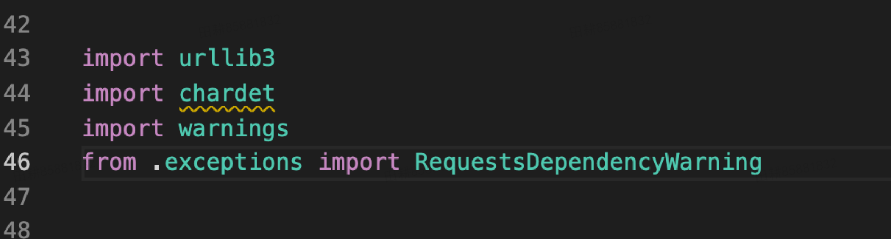

## 1. 代码风格
  一看到代码的组织结构，就觉得简洁明了，让人有读下去的欲望。
  
  首先一进入眼帘的几个文件夹，清清楚楚，明明白白，能够分得清他们的功能：
  
  甚至有写专门的测试文件夹！说明作者很重视测试的重要性。
  
  进入requests文件夹，非常清楚的能看到阅读的入口！
  
  进入init后，迎面走来清楚的代码介绍，以及使用方法
  
  整个主逻辑居然也不过区区138行！给人清爽的感觉，瞬间让人有读下去的欲望！

  注意kenneth大佬的代码风格：在使用前才import对应模块：
  
  

  全文有多处import。
## 2. 重点剖析
  从上往下看，第一处是逻辑是检查兼容性：
  
  
  check_compatibility函数中，多处用到了[assert](https://www.w3schools.com/python/ref_keyword_assert.asp)报异常！

  对于经常raise Exception()的我来说，又学到了。

  刚一不懂为什么，就标了注释：
 
  
  
  Pythonic的魅力！    
  
  
  
  [连续不等式语法糖](https://onetaken.blog.csdn.net/article/details/77769452?spm=1001.2101.3001.6661.1&utm_medium=distribute.pc_relevant_t0.none-task-blog-2%7Edefault%7ECTRLIST%7ERate-1.pc_relevant_default&depth_1-utm_source=distribute.pc_relevant_t0.none-task-blog-2%7Edefault%7ECTRLIST%7ERate-1.pc_relevant_default&utm_relevant_index=1)

  get时兜底的好习惯：
  
  
  
  语法糖again：
  
  
  
  
## 3. 总结
Kenneth 不愧为大佬，requests也不愧被评为非常优秀的Python开源项目，代码风格言简意赅，语法糖使用清楚、适度，理解毫不费力。Kenn的注释并不用来注释逻辑，而是用来注释目的和用途，这点可以学来提升注释质量！
   
