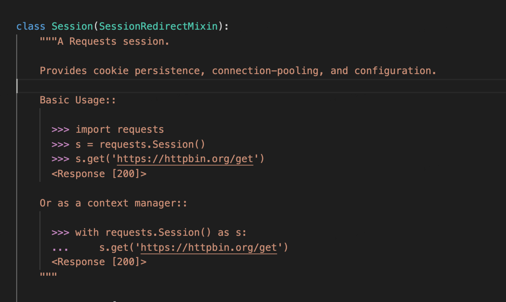
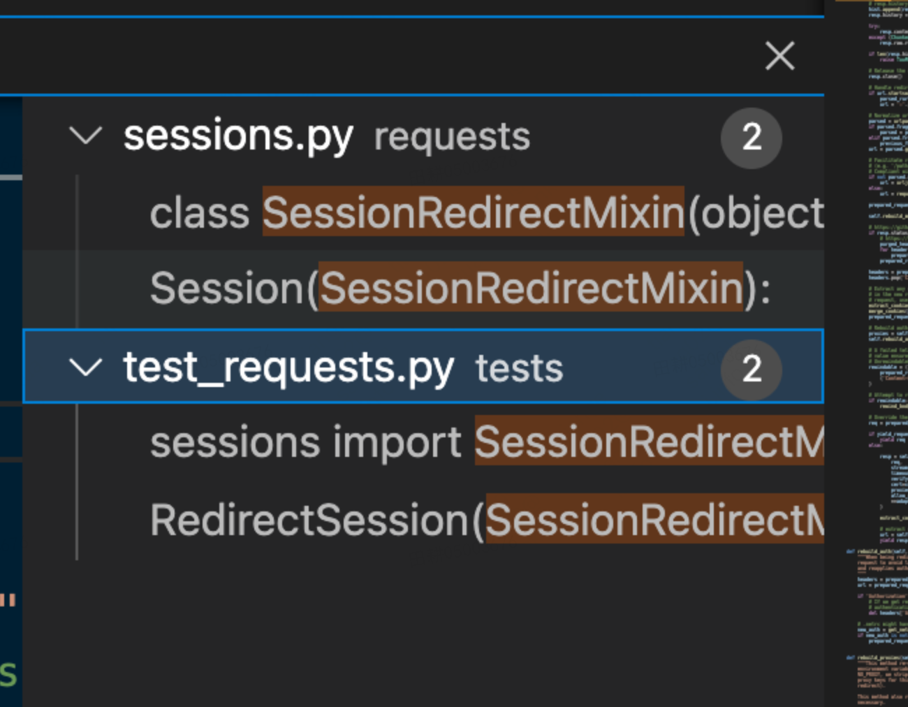
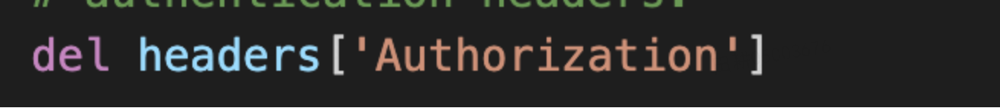
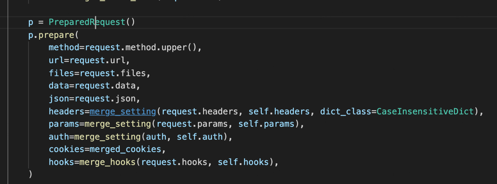
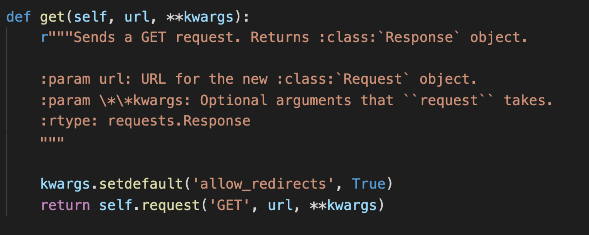
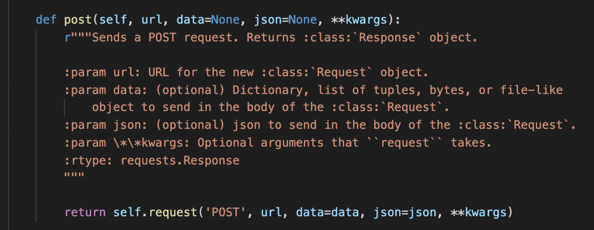
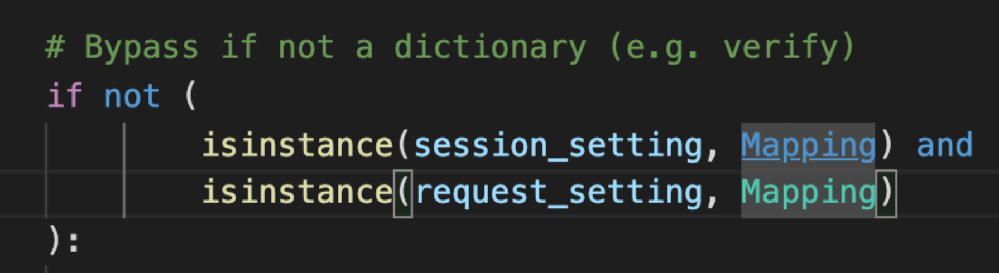
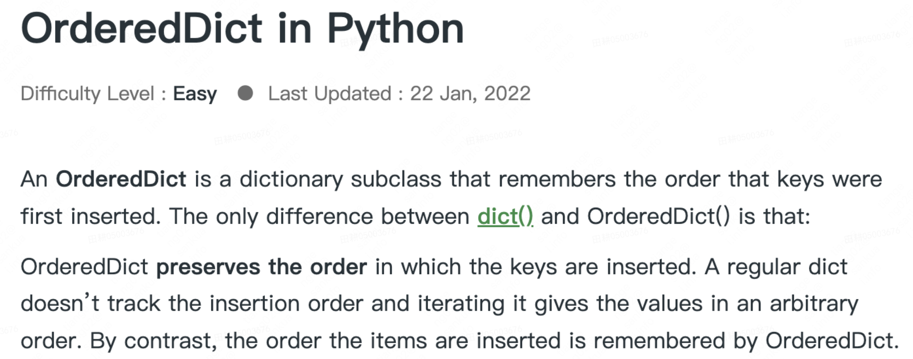
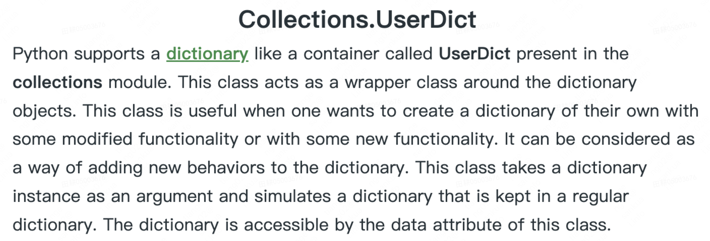

## 1. 代码风格
简洁明快。注释清楚得当。读起来不费劲。
## 2. 重点剖析
  
  
  开头的注释依然很清楚，注明了函数存在的用意。
  
  
  
  注意这里`{!r}.format()`的意思是调用__repr__: returns a printable representation of the given object。[__str__和__repr__的异同](https://stackoverflow.com/questions/1436703/what-is-the-difference-between-str-and-repr)
    
  
  
  这里写HTTPAuth前写AuthBase作为基类，方便日后扩展和避免重复代码。好评！
  [__call__的含义](https://blog.csdn.net/Yaokai_AssultMaster/article/details/70256621)
  
  
  
  __eq__判定相等的意思。这里all()是判断iterable里的内容是不是都为True。
  
  
  
  这里使用Pythonic的方式定义函数，很妙！
  
  
  
  Pythonic的变量写法。
  
## 3. 总结
本节是对BA验证具体逻辑的实现。逻辑方面较为复杂，但依然有代码规范上的学习空间。如有深入学习逻辑的需要，可以再挖掘。个人觉得得益于项目良好的代码习惯，难度不会太大。
## 1. 代码风格

本篇代码逻辑较为复杂，但是跟随信息量大的注释，可以理解作者的主要逻辑。

## 2. 重点剖析

session类的开头有一大段注释说明清楚该类的功能和用法。

  

Session继承自一个Mixin类。

为什么要有Mixin呢？摘自[理解Mixin](https://zhuanlan.zhihu.com/p/95857866)。

** Mixin是一种将经常复用的代码摘自父类，专门用于子类继承的类。**

  

Mixin类同时还在tests中被调用。可见拆出Mixin可以更方便针对这一块做单元测试。

  

巧妙的判断值方式。

  

删除字典里元素的方式。

在发起request前，对参数的准备，统一放到一个类的方法中进行。

 
 
 
  
 

通过拆出request的方式，减少重复代码。

注意检查一个对象是否为dict的方式：

 

并不是isinstance(something, Dict) 因为dict包含dict， orderedDict和UserDict三种！

 
 
 

注意，要想重写内置的dict，不可继承dict方法。必须继承UserDict。[详解](https://www.gairuo.com/p/python-userdict)。

## 3. 总结

相对于__init__，session的代码更为复杂。其中也引入了一些其他模块，待以后再详细剖析。

尽管是如此复杂的代码，在函数开头Kenneth都会写言简意赅的注释： 注释清楚函数的作用，输出内容、类型。

擅用Mixin类，避免重复代码。

注意判断dict类型的方式： Mapping

