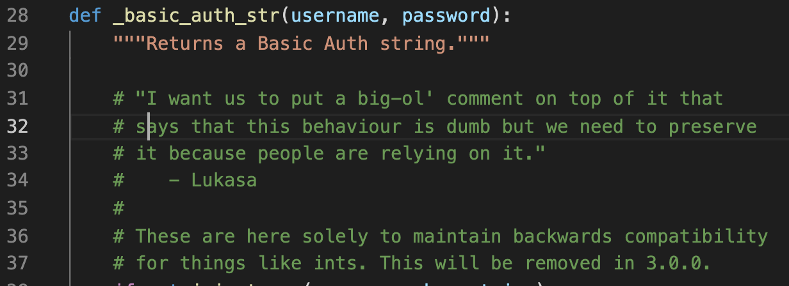
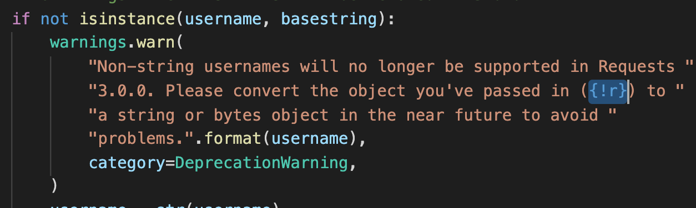
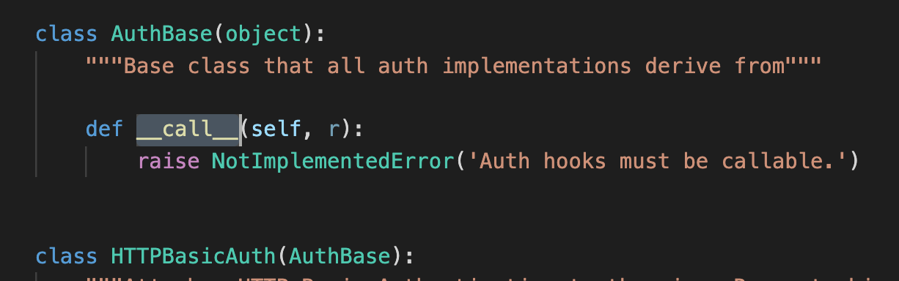
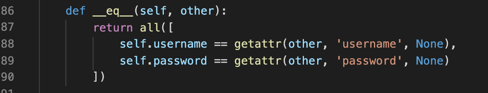
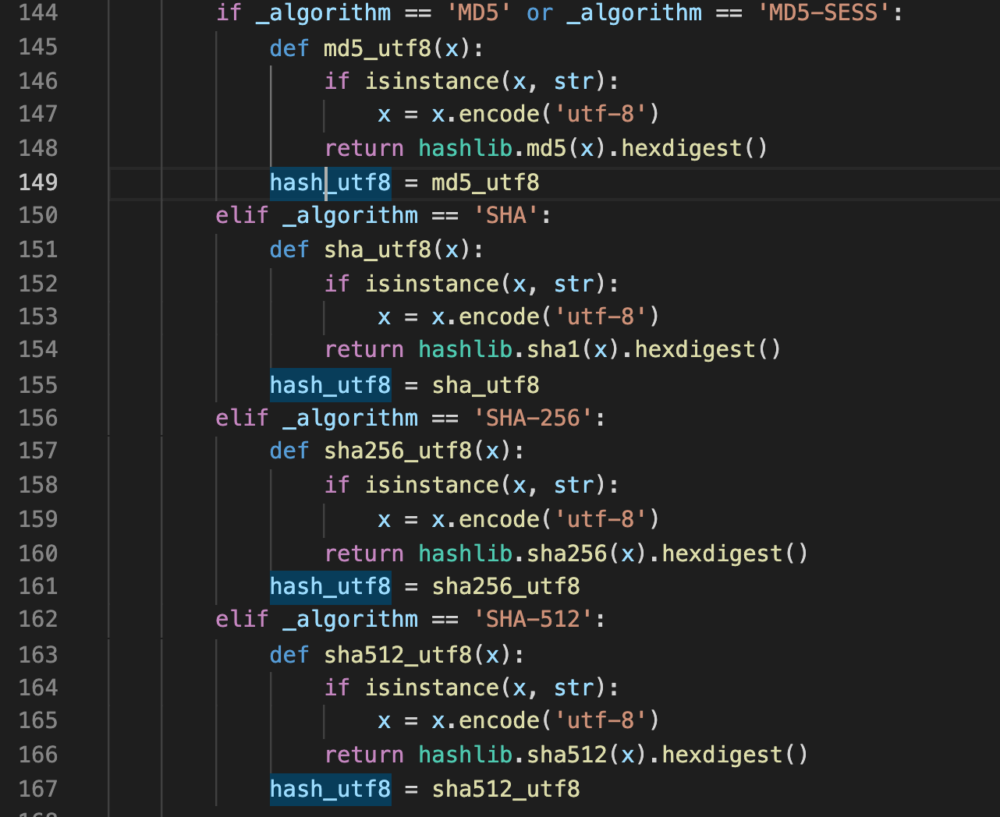
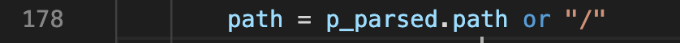

## 1. 代码风格
简洁明快。注释清楚得当。读起来不费劲。
## 2. 重点剖析
  
  
  开头的注释依然很清楚，注明了函数存在的用意。
  
  
  
  注意这里`{!r}.format()`的意思是调用__repr__: returns a printable representation of the given object。[__str__和__repr__的异同](https://stackoverflow.com/questions/1436703/what-is-the-difference-between-str-and-repr)
    
  
  
  这里写HTTPAuth前写AuthBase作为基类，方便日后扩展和避免重复代码。好评！
  [__call__的含义](https://blog.csdn.net/Yaokai_AssultMaster/article/details/70256621)
  
  
  
  __eq__判定相等的意思。这里all()是判断iterable里的内容是不是都为True。
  
  
  
  这里使用Pythonic的方式定义函数，很妙！
  
  
  Pythonic的变量写法。
  
## 3. 总结
本节是对BA验证具体逻辑的实现。逻辑方面较为复杂，但依然有代码规范上的学习空间。如有深入学习逻辑的需要，可以再挖掘。个人觉得得益于项目良好的代码习惯，难度不会太大。
   
