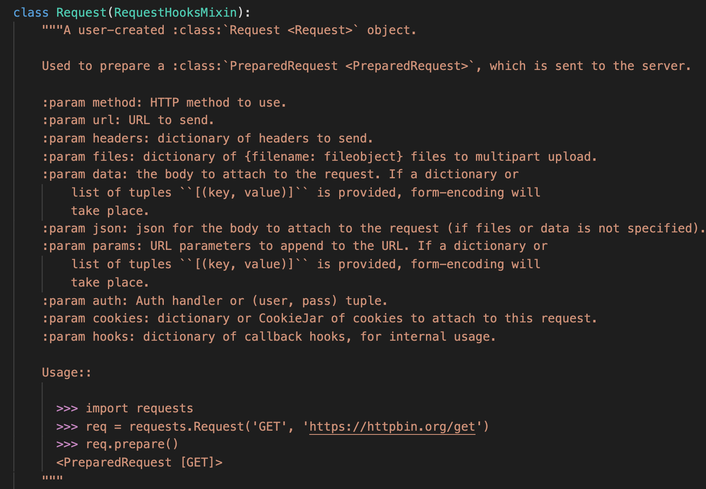
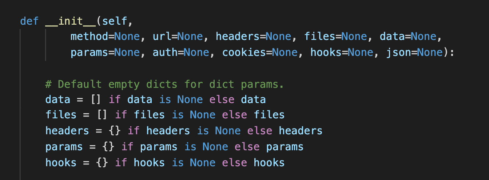
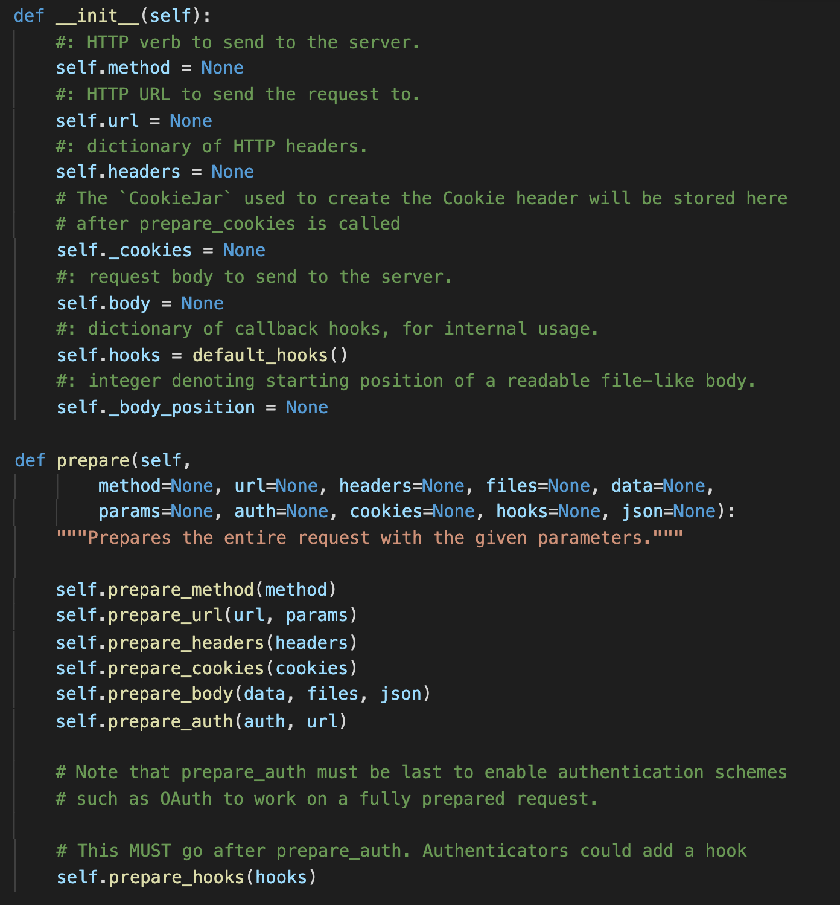
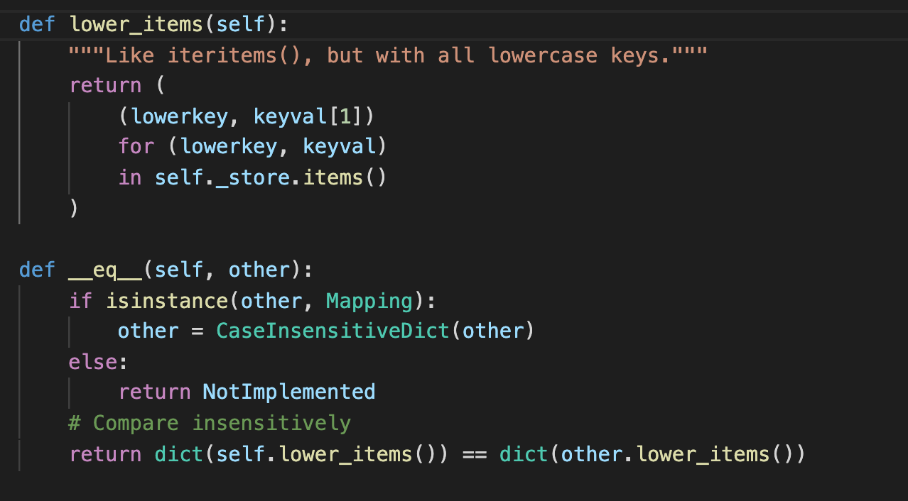
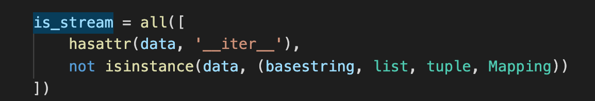
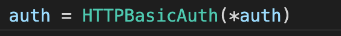

## 1. 代码风格
本页代码本质上是构造resquest和response对象的过程。运用了很多Pythonic的写法。主要的http连接逻辑在adapters.py中，调用了Python原装库，运用了线程池等相关知识。
## 2. 重点剖析
  
  
  学习一下这里的注释的写法。介绍类型，作用。再加上Param的定义。最后描述用法。
  
  
  
  注意这里的变量赋值！并没有让参数默认为[]或{}，而是设为None，后续进行判断后赋值：可以防止传入None！
  
  
    
  可以学习这里参数赋初值（None），然后prepare方法详细构造值。
  
  
  
  这里构造dict的方式非常巧妙。在Python中，dict([(,)])的方式可以构造字典！dict == dict可以比较字典是否相等（比较内容，而非Java当中比较引用）。
  **Python中“is“才是比较引用。==是比较值。调用__eq__方法！** [is和==在python中的区别](https://realpython.com/courses/python-is-identity-vs-equality/)
  
  
  
  这里all的使用方式很妙，很Pythonic。all()的作用是比较iterable是不是bool(x)都是True。这里isinstance(,(,))也可学习，同时比较多种类型，等价于or。
  
  
  
  这里也是很Pythonic的传参方式！(*var)的含义是将var转成没有key的参数传入函数。比如test=(1,2,3),`test=(1,2,3) print(*test)`的结果是1 2 3。[参数加*的含义](https://www.geeksforgeeks.org/python-star-or-asterisk-operator)
  
## 3. 总结
代码化繁为简。运用了Pythonic的写法让代码更简洁，更易读。非常合理的简化了复杂的逻辑。对于多态的应用也十分到位。自己开发时也应避免重复造轮子。面对定制化需求时，合理运用多态特性。
