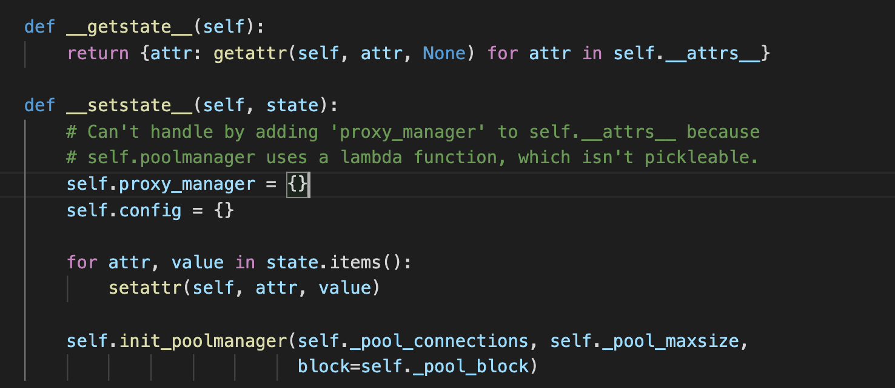
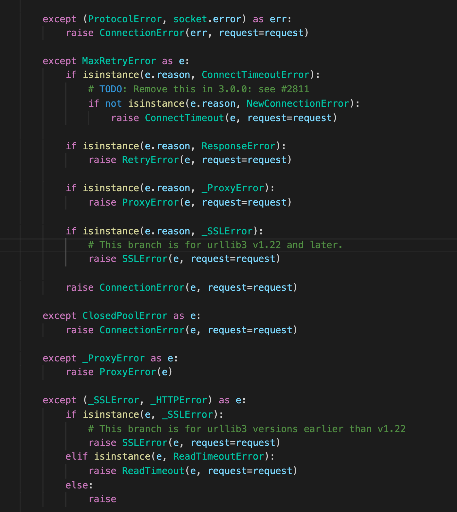
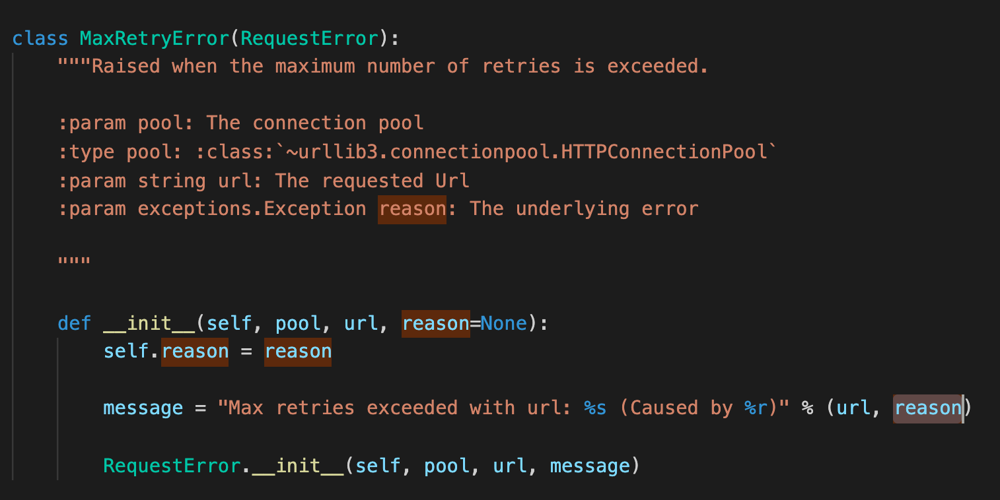
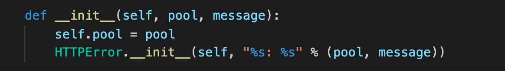

## 1. 代码风格
本页代码是调用Python API进行创建线程池和链接的过程。风格上十分语义化。注释十分充分。Exception Handling的内容值得学习。
## 2. 重点剖析
  
  
 __getstate__,__setstate__是对Python对象进行序列化的方法。不同于[pickling](https://docs.python.org/3/library/pickle.html)。
 顺带查了一下__dict__的含义，[参考如下](https://stackoverflow.com/questions/48029249/python-dict)。在Python中，”所有“的东西都是对象。包括类。##类也是对象##！所以与类相关的属性，如不带self的参数，函数，等，都是被存储在__dict__里。
  
  
  
  这里的Exception处理的很巧妙。MaxRetryError拥有一个reason属性，再细化器对于错误原因的记录。
  
  
    
  特别是MaxRetryError，在类里自定义类原因和，message，并做输出。
  
  在看Error具体内容时，发现了很有意思的一句话：
  
  
  
  为什么这里不直接调用构造方法，而是调用__init__()呢？
  你是不是还以为Python中__init__()即为构造方法，阅读一下[这个文档](https://blog.csdn.net/ffantastic/article/details/82025068)吧。
  比较重要的一点是，__init__并不负责分配内存空间！__new__才是。
  
  
## 3. 总结
要写好的代码，好注释非常重要。Excetion Handling可以通过继承的方式实现。比我之前通过枚举类型的写法灵活很多。
