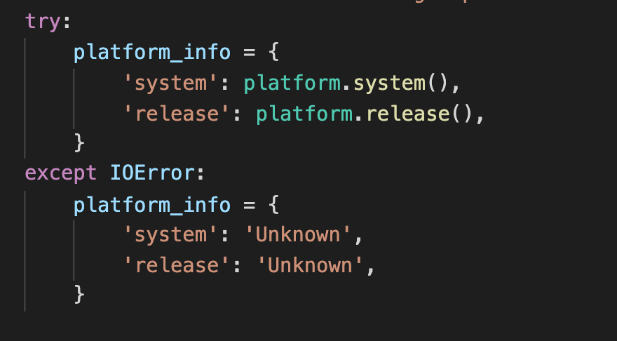
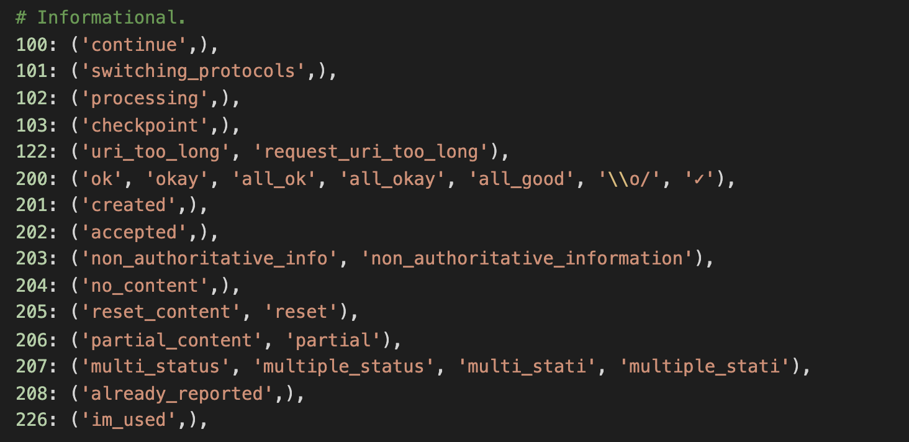
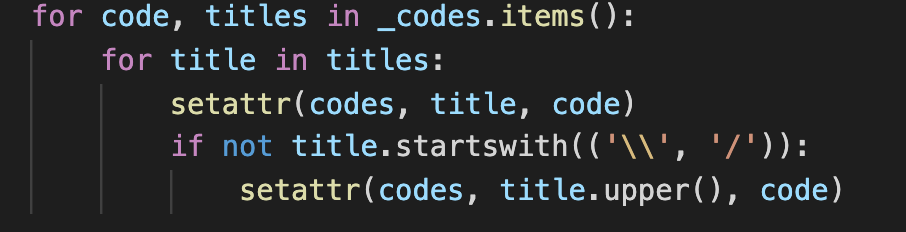

## 1. 包含内容

本篇包含了上面没有单独拎出来的包内脚本的学习。代码行数都较少。故总结成一个review。

## 2. help.py
  本脚本主要为debug时输出基础信息所用。多是一些信息的组织。比较值得借鉴的地方有：
  
  
  
  try except的合理使用：用来提供异常的解决办法。而不是层层往外抛。
 
## 3. status_codes.py

  该库主要用来输出库简介的__doc__,和异常名称对应的异常值，如 >>> requests.codes['temporary_redirect']， 307。
  
  
  
  值得借鉴的是他组织内容的方式。在structures.py中新建了一个数据结构LookupDict。然后采用这样的loop用setattr设置dict值：
  
  
  
  structure的具体细节在下一章中详细阅读。
  
## 4. _internal_utils.py

   该库主要存放内部使用且极少使用外界帮助的工具函数。定义原文：

   

   没啥好说的。以后注意可以把内部工具函数放在_internal_utils.py里。

