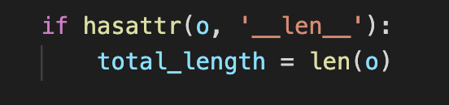
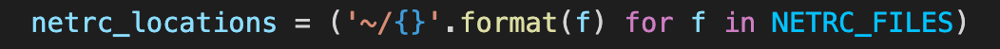
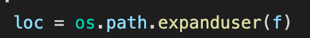
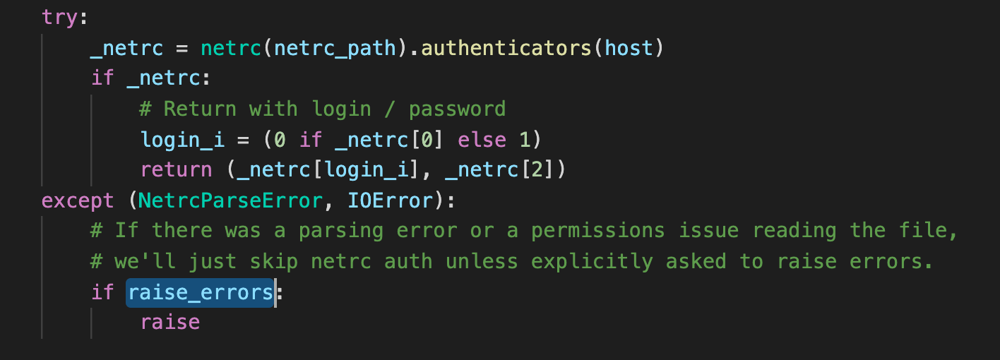
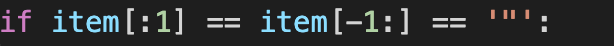
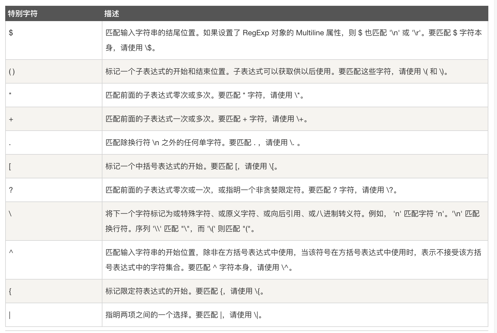

  
  
  __len__在len()的时候生效。
 
  
  
  这是一种非常Pythonic的写法。注意，这里生成的是一个generator类型的对象。可以用for遍历。
  
  
    
  这里的expanduser是用来取代路径里的～/～user，获取真实路径的。
    
  
  
  这里是一种可选是否要raise error的方法。raise_errors通过函数参数注入（默认为False）。如果显式注入True，则raise这个exception。
  注意：这里raise不带参数的用法是raise 最近raise过的一个Exception。详见[raise无参数](https://stackoverflow.com/questions/3228591/python-rasing-an-exception-without-arguments)
  
  
  
  一个很好用的创建临时文件的方法，用完即删，而且不用担心race condition。
  
  
  
  很Pythonic的写法，意思是把member用‘/’隔开，然后作为一组参数传入join中。
  
  
  
  注意: 对于字符串来说, item[-1]和item[-1:]的含义是一样的，但对于数组来说，item[-1]等于最后一个对象，item[-1:]等于把最后一个对象取出来，构造成list。
  
  
  
  这些正则你都知道含义吗？正则表达式FYI：
  
  
 
